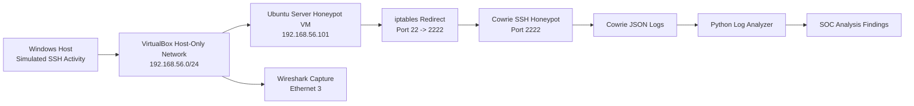
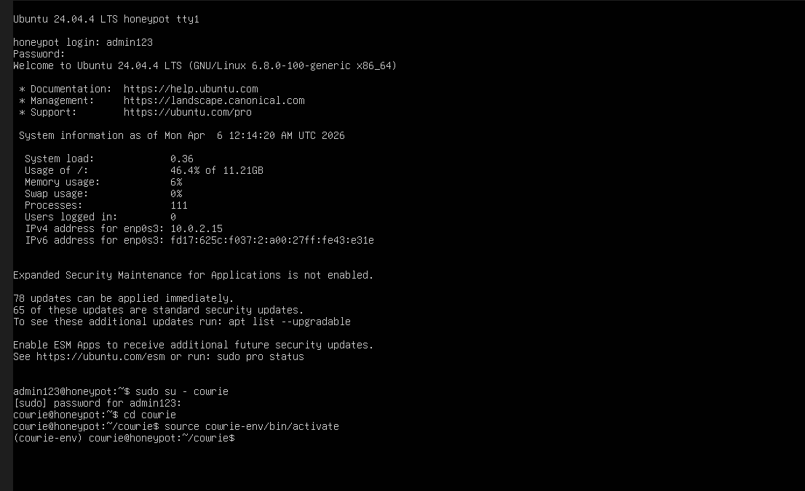
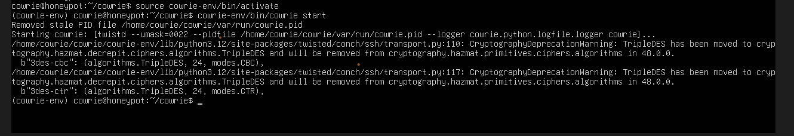
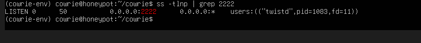
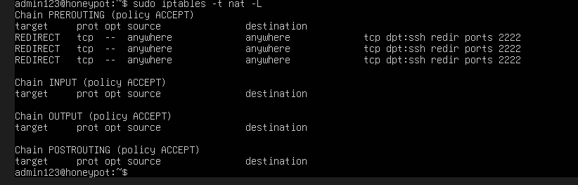
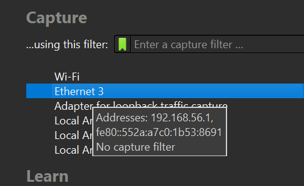
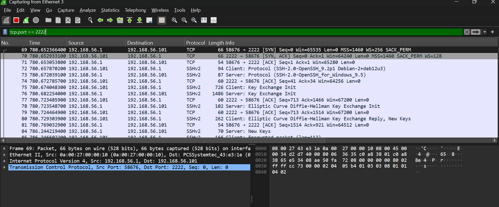
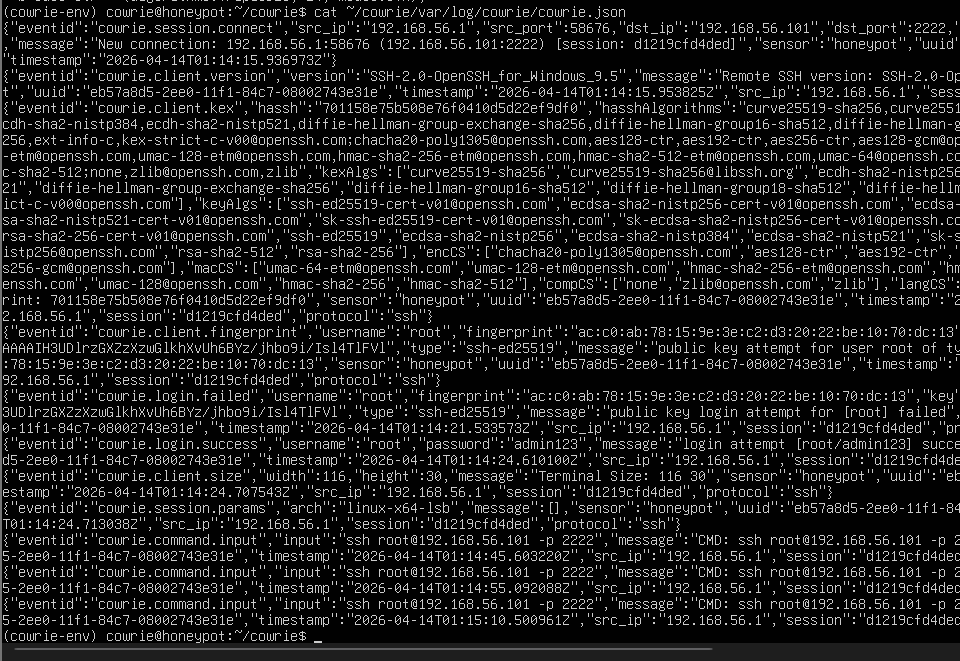
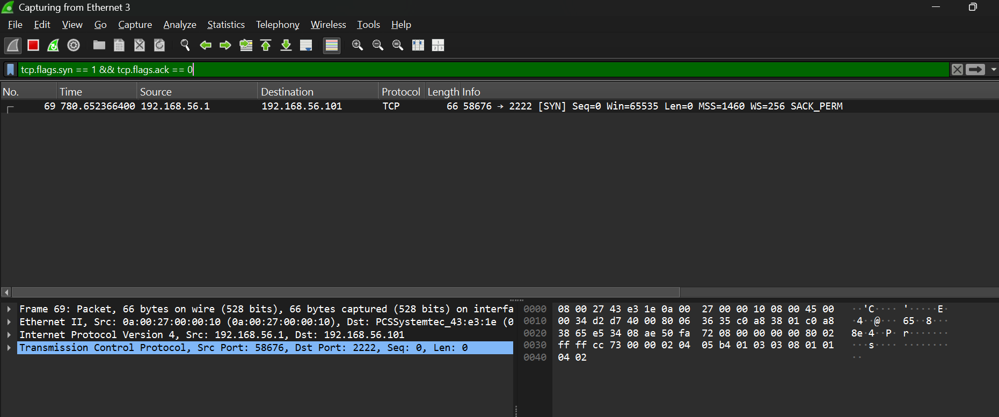
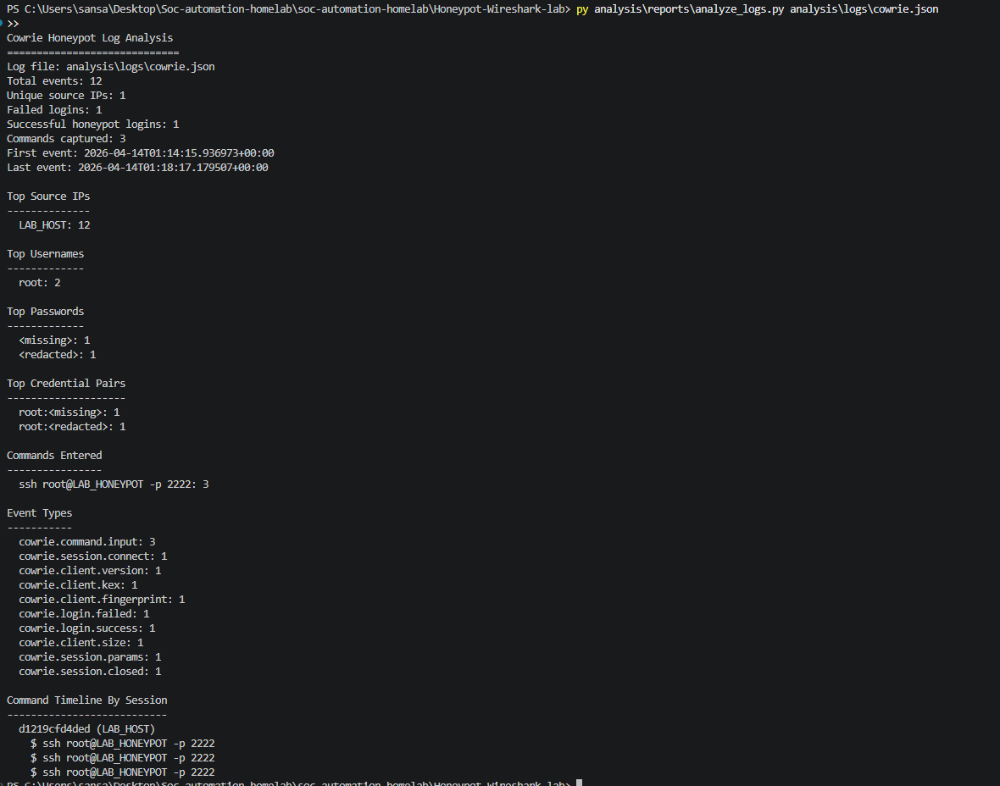

# Honeypot + Wireshark Cybersecurity Lab

## Overview

This project demonstrates a cybersecurity home lab that captures and analyzes SSH attack activity using a Cowrie honeypot, Wireshark packet capture, and Python log analysis.

The lab simulates a real SOC investigation workflow. A Windows host generates SSH login attempts against an Ubuntu Server honeypot VM. Cowrie records attacker behavior at the application layer, while Wireshark captures the related network traffic. A Python analysis script then parses the Cowrie JSON logs to summarize source IPs, credentials attempted, commands executed, and attack timeline.

This project was built as a SOC Analyst portfolio project to demonstrate practical skills in honeypot deployment, packet analysis, log analysis, attack simulation, and security documentation.

---

# Architecture

The lab pipeline implemented in this project:

Windows Host -> VirtualBox Host-Only Network -> Ubuntu Honeypot VM -> Cowrie SSH Honeypot -> Cowrie JSON Logs -> Python Analysis Report

Wireshark runs on the Windows host and captures traffic between the host machine and the honeypot VM.

Architecture diagram:



Full architecture notes: [docs/architecture.md](docs/architecture.md)

---

# Tools Used

| Tool | Purpose |
| --- | --- |
| Cowrie | SSH/Telnet honeypot used to capture login attempts, credentials, sessions, and commands |
| Wireshark | Packet capture tool used to inspect SSH traffic and TCP behavior |
| Python | Parses Cowrie JSON logs and generates a readable analysis report |
| VirtualBox | Provides an isolated VM environment for the lab |
| Ubuntu Server | Operating system used for the honeypot VM |
| iptables | Redirects SSH traffic from port 22 to Cowrie on port 2222 |
| GitHub | Hosts project documentation, screenshots, scripts, and evidence |

---

# Project Workflow

The project simulates a basic SOC investigation: generate suspicious SSH activity, collect host/application logs, capture packets, analyze the evidence, and document findings.

---

## 1. Cowrie Environment Setup

Cowrie was installed on an Ubuntu Server VM and run inside its Python virtual environment.

Screenshot:



---

## 2. Honeypot Service Started

Cowrie was started from the VM and configured to emulate an SSH service.

Screenshot:



---

## 3. Port Listening Verification

The honeypot was verified as listening on TCP port 2222.

Screenshot:



---

## 4. SSH Port Redirection

iptables was used to redirect traffic from port 22 to Cowrie's listening port, 2222.

Screenshot:



---

## 5. Wireshark Interface Selection

Wireshark was configured on the Windows host to capture traffic on the VirtualBox host-only network interface.

Screenshot:



---

## 6. Attack Simulation and Packet Capture

SSH login attempts were generated from the Windows host against the honeypot VM. Wireshark captured the SSH handshake and traffic to port 2222.

Screenshot:



Packet capture:

[capture/pcaps/honeypot-capture-demo.pcapng](capture/pcaps/honeypot-capture-demo.pcapng)

---

## 7. Cowrie Log Collection

Cowrie recorded the simulated SSH activity in structured JSON logs, including connection metadata, login attempts, and commands entered in the fake shell.

Screenshot:



Sanitized sample log:

[analysis/logs/cowrie.json](analysis/logs/cowrie.json)

---

## 8. Network Filter Analysis

Wireshark display filters were used to isolate SSH honeypot traffic and TCP SYN packets.

Screenshot:



Filters:

[capture/filters/wireshark-display-filters.txt](capture/filters/wireshark-display-filters.txt)

---

## 9. Python Log Analysis

A Python script was created to parse Cowrie JSON logs and summarize the activity observed in the honeypot.

Script:

[analysis/reports/analyze_logs.py](analysis/reports/analyze_logs.py)

Screenshot:



---

# Analysis Findings

The Python analysis report identified:

- 12 total Cowrie events
- 1 unique source host in the lab environment
- 1 failed login attempt
- 1 successful honeypot login
- 3 commands captured after login
- SSH command activity recorded inside the fake Cowrie shell
- Cowrie event types including session connection, client fingerprinting, login success/failure, command input, and session close

All sensitive values were sanitized before being committed to GitHub.

---

# MITRE ATT&CK Mapping

This simulated activity maps to common attacker behavior tracked by MITRE ATT&CK:

| Technique | Description | Lab Evidence |
| --- | --- | --- |
| T1110 - Brute Force | Repeated SSH credential attempts against a remote service | Cowrie login failure/success logs |
| T1021.004 - Remote Services: SSH | Use of SSH to access a remote system | SSH traffic captured in Wireshark and Cowrie sessions |
| T1046 - Network Service Discovery | Identification and interaction with exposed network services | TCP connection attempts and SYN traffic |
| T1059 - Command and Scripting Interpreter | Commands entered after interactive access | Cowrie command input events |

---

# Skills Demonstrated

This project demonstrates several SOC analyst and cybersecurity lab skills:

- Honeypot deployment and validation
- Linux service operation and troubleshooting
- VirtualBox host-only networking
- SSH traffic simulation
- Packet capture with Wireshark
- TCP handshake and SYN packet analysis
- JSON log parsing with Python
- Basic attack timeline reconstruction
- Evidence sanitization before public GitHub publishing
- Security documentation for portfolio presentation

---

# Repository Structure

```text
Honeypot-Wireshark-lab/
|-- analysis/
|   |-- logs/            # Sanitized Cowrie JSON logs
|   |-- alerts/          # Future alerting scripts
|   `-- reports/         # Python analysis scripts
|-- assets/
|   `-- screenshots/     # Lab screenshots and evidence
|-- capture/
|   |-- filters/         # Wireshark display filters
|   |-- pcaps/           # Saved packet captures
|   `-- scripts/         # Future tshark automation scripts
|-- docs/
|   |-- architecture.md  # Architecture notes
|   `-- setup.md         # Step-by-step setup guide
|-- honeypot/
|   |-- config/
|   |-- cowrie/
|   `-- dionaea/
|-- infra/
|-- tests/
|-- .env.example
|-- .gitignore
`-- README.md
```

---

# Status

Version 1 is complete.

Completed:

- Cowrie honeypot deployed
- Wireshark capture configured
- SSH attack activity simulated
- Cowrie JSON logs collected
- Packet capture saved
- Python analyzer created
- Analysis output generated
- Screenshots added
- README and documentation polished

Future improvements:

- Add automated `tshark` capture script
- Add alerting for new Cowrie login events
- Add more simulated attack types
- Add dashboarding with Grafana or ELK
- Add Dionaea malware honeypot component

---

# Author

San Saad  
[GitHub](https://github.com/San-Saad)

---

This project is for educational and portfolio purposes only. All activity was performed in an isolated lab environment on systems owned by the project author.
