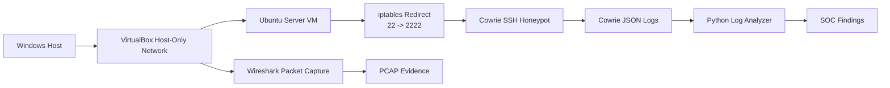

# Architecture

This document describes the architecture of the Honeypot + Wireshark Cybersecurity Lab.

## High-Level Design

The lab is designed to simulate suspicious SSH activity in a controlled environment, capture the traffic, collect honeypot logs, and analyze the results.



## Components

### Windows Host

The Windows host performs three roles:

- Generates simulated SSH activity
- Runs Wireshark to capture packets
- Stores the GitHub repository, screenshots, packet captures, and Python analysis output

### VirtualBox Host-Only Network

The lab uses a VirtualBox host-only network so the Windows host can communicate with the Ubuntu honeypot VM without exposing the honeypot to the public internet.

Lab network:

```text
Windows host: 192.168.56.1
Honeypot VM: 192.168.56.101
```

### Ubuntu Honeypot VM

The Ubuntu Server VM hosts Cowrie and acts as the target system.

Cowrie listens on:

```text
TCP/2222
```

iptables redirects SSH traffic:

```text
TCP/22 -> TCP/2222
```

### Cowrie SSH Honeypot

Cowrie emulates an SSH service and records attacker behavior.

Captured fields include:

- Source IP
- Source port
- Destination IP
- Destination port
- Session ID
- SSH client version
- Username attempted
- Password attempted
- Login success or failure
- Commands entered
- Session close events

### Wireshark

Wireshark captures traffic on the VirtualBox host-only interface.

The packet capture provides network-layer evidence such as:

- TCP handshake
- SYN packets
- SSH protocol negotiation
- Encrypted SSH traffic
- Source and destination IPs
- Source and destination ports

### Python Analyzer

The Python analyzer parses Cowrie JSON logs and produces a readable report for SOC-style review.

The report includes:

- Total events
- Unique source IPs
- Failed login count
- Successful honeypot login count
- Commands captured
- Top usernames
- Top passwords
- Top credential pairs
- Event type counts
- Command timeline by session

## Data Flow

1. SSH activity is generated from the Windows host.
2. Traffic reaches the Ubuntu honeypot VM through the VirtualBox host-only network.
3. iptables forwards SSH traffic to Cowrie on port `2222`.
4. Cowrie records session, login, and command activity to JSON logs.
5. Wireshark captures the network traffic at the same time.
6. Cowrie logs are sanitized before being committed to GitHub.
7. The Python analyzer parses the sanitized log and generates findings.

## Security Controls

The lab uses the following safety controls:

- Isolated VirtualBox host-only networking
- Sanitized logs before GitHub publishing
- No real credentials committed
- No private keys committed
- Demo packet capture only
- Educational use only

## Evidence Artifacts

Primary artifacts:

- `assets/screenshots/`
- `capture/pcaps/honeypot-capture-demo.pcapng`
- `analysis/logs/cowrie.json`
- `analysis/reports/analyze_logs.py`
- `capture/filters/wireshark-display-filters.txt`

These artifacts show the project from setup through analysis and provide proof that the lab was built and tested end to end.
